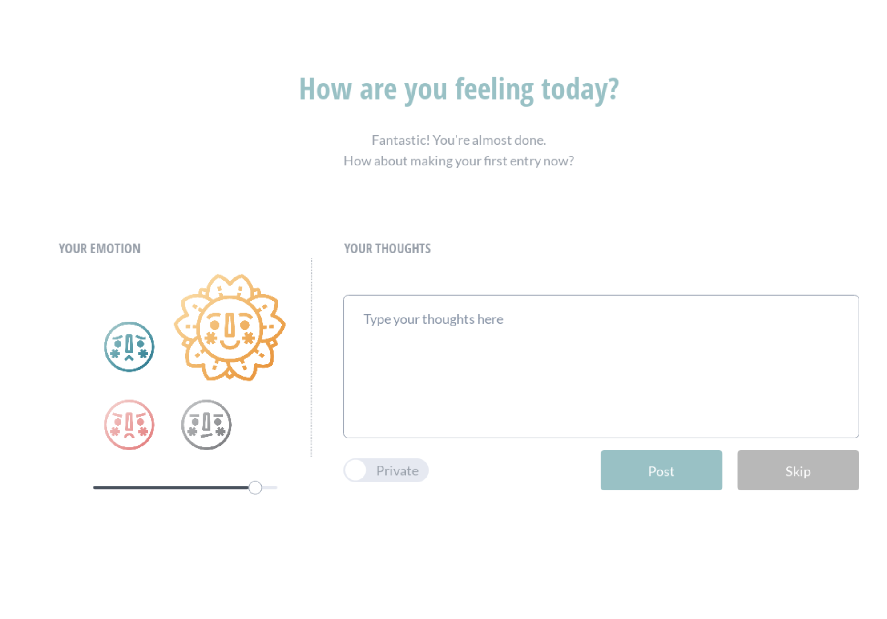

# [BrainMate - View React Code](https://github.com/katieofcode/brainmate)

## React, Firebase
Brain Mate is a mental health application that helps you realize that you are never alone.
This application combines an element of community with writing personal diary entries.

This project was started in November 2018 with a team of four people, scattered across Hawaii, Portland, and Chicago. After doing extensive research and interviewing seven volunteers who all suffer from mental illness at different capacities, I worked with a graphic designer to create our logo and create a user registration flow. I am now working with the front-end and backend developers to create the registration flow that I had prototyped. 

This is a React application that is using Firebase. At this time, we also solidified the style of the app, our mission, and how we want to address the pain points expressed in the interviews.

### How we created this app:
## Step 1: Discovery Phase

I knew that I wanted to create an app from the ground up, but I wanted to do it correctly. That means I needed to have a thorough understand of our potential users. I enlisted the help of volunteers that have struggled with mental health problems. I was also looking for participants who already currently use daily management apps, as BrainMate is something that would be used daily.

I interviewed seven people and transcribed all conversations (with consent of the interviewees.) I then color-coded common themes that would occur in conversations such as "relationships", "sleep" or "getting out of bed". Below is an example of what the data looked like.

## Step 2: Branding and Mockup Creation

After analyzing all of the data, I realized the pain points of my potential users. Their experiences helped me get a better idea of what I wanted to create. The next step was to communicate with my graphic designer. I talked to him at length about the type of style I wanted to go for and what our mission is. He designed a logo that we could both agree on. He also designed these amazing flowers that show your emotion! Once we had the logo, we had a color palette that we wanted to work with. A light pink and a light blue. We used Marvel to make wireframes and mockups. I wanted to the process to be interesting for my graphic designer, so I showed him a little bit of the world of product design. We worked together in thinking of how users would go through the registration and came up with a flow. We then thought of how we want to tackle viewing a calendar of your emotions and the community board.

## Step 3: Implementation

After about a month of doing research and working on the design, I was ready to begin building out the application with my engineering team. We meet weekly via Google Hangouts and do our own work indivually throughout the week. After much discussion, we decided to handle authentication and data storage with Firebase. Currently, I handle 100% of the styling of the application using CSS. We are currently working on finishing the MVP of this application, but here are some images of what we have completed so far.

# [Doko Travel - View Ruby Code](https://github.com/KatieOfCode/Doko-Travel)

## Ruby, Rails, Materialize
Doko Travel is an application I built for people who want to share their Japan itineraries with other users. Users will also have the ability to get a custom itinerary matched with them based on their preferences that they selected. I had originally built this in Ruby/Rails as my capstone project. It has CRUD functionality and different views for admins and users. I practiced using Many-to-Many relationships, as well as One-to-Many relationships between the data. When you register you are taken to a questionnaire which saves your answers to the database.

Admins and users can both add itineraries to the application and people can upvote them if they think it is a good itinerary. When you add an itinerary there are certain parameters that need to be filled which include, length of stay, what the itinerary entails (locations and description), and also categories/interests that this itinerary includes. Here is a list of created itineraries.

# [Doko Travel - View React Code](https://github.com/KatieOfCode/dokotravel2.0)

## React, Gatsby
When I decided to do another version of this application, I knew I didn't want to have the same functionality because I want to actually deploy this website so that I can help people plan their upcoming trips to Japan. I wanted it to be more of a website for my service rather than an automated application that generates itineraries. I really wanted to focus on creating a beautiful UI filled with lots of my own pictures from my travels.

[If you would like to see the deployed version (WIP) please feel free to go here!](https://zen-lovelace-7fd594.netlify.com/)

# [Github Clone - View Angular 2 Code](https://github.com/KatieOfCode/GitSome)

## Angular 2, GitHub API
One thing I love doing is to clone websites. I love the challenge of figuring out how a certain company  does their styling. The first time I tried to replicate a websites styling was in code school. My partner and I chose the GitHub API, and I decided that I would do the styling to look exactly like GitHub. We called our application GitSome, an application that finds your ideal pair programmer using location, follower count, and language that your most recent repo is coded in.

# [Github Clone - View React Code](https://github.com/KatieOfCode/thisdotexercise)

## React, GitHub API
I recently revisited the GitHub API for a coding challenge, so I decided to redo the styling to make it more responsive this time around. [The project is deployed, so feel free to visit that here.](https://mystifying-johnson-8a1da7.netlify.com)The challenge was to be able to make a query to GitHub's API and return a list of users with a similar username. This is a more traditional clone as opposed to the GitSome app which I tried to make witty.

